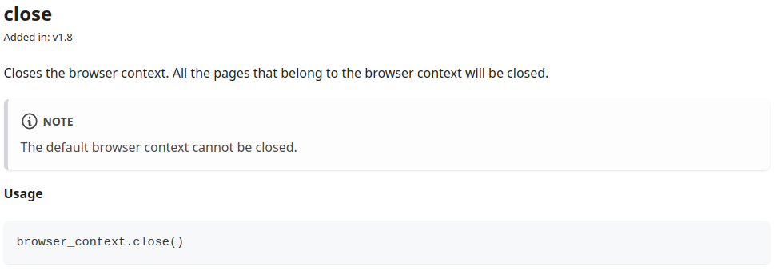

# scrapy_playwright_guide

This guide demonstrates how to implement scrapy-playwright based on a real-world business application involving 48 spiders. The goal is for it to serve as a reference and a starting point for further explorations. We gladly expect your comments.

## Introduction

The Playwright tool has diverse applications, chosen for a variety of reasons. This guide primarily focuses on its use for extracting information from a website, which may require specific certificates for access and/or dynamic actions.

## Considerations

The presented documentation corresponds to tests conducted with the following stack:
- Python 3.11.6 (Docker Slim Image)
- Scrapy 2.5.1
- Playwright 1.39.0
- Scrapy-Playwright 0.0.33

Additionally, Playwright was configured to use Mozilla Firefox version 115.

## Use of JavaScript on the Site

A good starting point is to analyze the loading behavior of the information to be extracted. The decision to perform dynamic actions on the site depends on whether you choose to work directly with the Page object or not.

One way to determine this is by using the Firefox browser, as explained below:
1. Type about:config in the Firefox address bar.
2. Search for javascript.enabled and toggle its value.
3. Reload the site. If there are no differences, and all the required information is present, manual handling of the Page object may not be necessary.

## How to Implement scrapy-playwright in a Spider?

Whenever you want to access a specific URL using the tool, you must invoke the Request with the "playwright": True parameter in the meta dictionary. 
If Requests generated from start_urls require this behavior, you should modify the start_requests method, which is implemented by default in Scrapy.

A crucial decision must be made at this point: is it necessary to have access to the page to perform actions? Often, simply raising the request using Playwright meets our needs. Otherwise, you should include the "playwright_include_page": True parameter in the meta dictionary of the yield Request method.

If the site requires certain permissions that were previously applied in Scrapy parameters such as cookies and/or headers in Request, when using Playwright pages, they should be applied through contexts. 

To do this, activate Playwright handling for Headers with the following configuration (in the project settings globally or in custom_settings at the spider level):

```python
PLAYWRIGHT_PROCESS_REQUEST_HEADERS = None
```

Be cautious because the cookie specification format is different for Playwright and Scrapy ([check the documentation](https://playwright.dev/python/docs/api/class-browsercontext#browser-context-add-cookies "BrowserContext-cookies")).

In contexts, you can refer to the use of proxies to make requests. However, simultaneous use of cookies and proxies is not yet allowed.

## Parsing with Page

The `parse` method should be defined as an async method to enable the handling of dynamic actions that will be executed with an `await`. The Page object can be found in the meta dictionary of the Response object as "playwright_page".

To extract information from a page, you can use Playwright methods ([check the doc](https://playwright.dev/python/docs/api/class-page)) or extract the content and convert it to a scrapy.Selector object to apply XPath or CSS methods.

The content will be a static version of the page. If you execute a dynamic action, the content of the Page object may differ from the content of the Selector. In this case, it can be re-extracted.

Finally, a decision must be made regarding the future of the open page. It can be reused in a `yield Request` method by adding "playwright_page": my_page to the meta dictionary, or it can be closed with the `await page.close()` method.

Note: Refer to the "Contexts" section for more details.

## Parsing without Page

If the information you want to extract is already contained in the Response object, there is no need to download the page's content and convert it to a selector. Instead, you can proceed to parse it directly with the Response.

If you are not going to use the page in the method, it's important not to include it in the `yield Request` method. By doing so, you are indicating that you will take care of its future, which could lead to errors of the type "Task was destroyed but it is pending!" (see the "Errors" section for more information).

### Simple Application Example

In the example provided below, a template for a Spider is shared, including the implementation of the methods `start_requests`, `async parse`, `async errback`, and `should_abort_requests` to abort requests with content that is not needed. 
It's important to note that avoiding these requests may appear suspicious from the server's perspective and could lead to blocking.

The Spider uses cookies within the context `context_cookies` defined in `custom_settings`. They could also have been passed as arguments in the `Request` method. 

One way to verify if they are being received by the server is to print the cookies that are set in the context of the current page. Importantly, do not retrieve the cookies from the Request or Response. By configuring as mentioned above, Playwright is given full control over Header management (including cookies), excluding them from Scrapy.

The example demonstrates how to extract the same information by converting the page's content into selectors and applying Playwright functionalities.

Generic waiting methods are referenced, as it is the programmer's personal decision which one to use. From our experience, the method that works almost universally is `wait_for_timeout(time)`, even though it is deprecated. 

Other methods are not applicable in all cases and often conclude without loading the desired content. Therefore, the choice depends on what we are specifically waiting for. A disadvantage of using this method is the default time wastage, as it will continue waiting even after our goal has been achieved.

You can find the example on the file src/example/example/spiders/example_simple.py

## Contexts

Various contexts can be created in the spider to distinguish the type of access being performed. Similar to pages, these contexts are opened and closed.

Special care must be taken when using the same context for multiple pages. The recommended order for closure, as established in the [scrapy-playwright documentation](https://github.com/scrapy-plugins/scrapy-playwright#avoid-race-conditions--memory-leaks-when-closing-contexts), is to first close the page and then close the context.

Here the docuementation of the `close()` method for BrowserContexts in Playwright for Python.


It is crucial to note the statement, "__All pages__ that belong to the browser context will be closed." 
This means that if there are 5 concurrent pages in the stack belonging to the same context, and we execute `context.close()` in the currently executing page, the context will close in all pages, but the page won't close, resulting in an error. 

Therefore, if the same context (even the default one) is used for multiple pages, we recommended not to execute its closure in the `errback` method or in circumstances where another page may continue executing with the same context.

Note: If possible, we recommend avoiding the use of contexts at the spider level, as mishandling their opening and closing can lead to concurrency errors.

## Errors

### Error: [asyncio] Task was destroyed but it is pending!

```
[asyncio] ERROR: Task was destroyed but it is pending!
task: <Task pending name='Task-1690' coro=<ScrapyPlaywrightDownloadHandler._make_req
uest_handler.<locals>._request_handler() running at /usr/local/lib/python3.11/site-p
ackages/scrapy_playwright/handler.py:579> wait_for=<Future pending cb=[Task.task_wak
eup()]> cb=[gather.<locals>._done_callback() at /usr/local/lib/python3.11/asyncio/ta
sks.py:764]>
```

This type of error occurs when attempting to destroy a task (an asyncio.Task object) that is still in the "pending" or "running" state. This typically happens when trying to cancel or terminate a task that is still in progress or has never started executing.

If necessary precautions are not taken, this error can be a common occurrence in program executions that use scrapy-playwright.

In practice, following the application pattern given by the examples in the official documentation, these errors are recurrent. We have observed a significant increase in these errors when closing pages and contexts at the end of a spider method. However, even without applying these closures, the errors continue to occur.

## Concrete Example

We present the code for a spider using scrapy-playwright as an illustrative example.

This spider triggers the click event on the link within each quote, redirecting to a page with information about the author. It extracts specific information using Playwright methods and then returns to the previous page.

The waiting method used is `wait_for_timeout(time)` mentioned earlier.

To extract the URL for the next list of quotes, it uses the Selector generated from the page's content. It raises a new Request, reusing the current Page object.

You can find the example on the file src/example/example/spiders/example_quotes.py .
